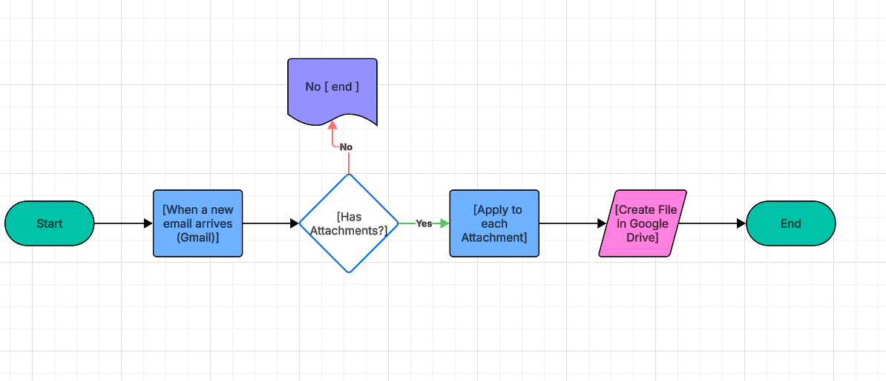
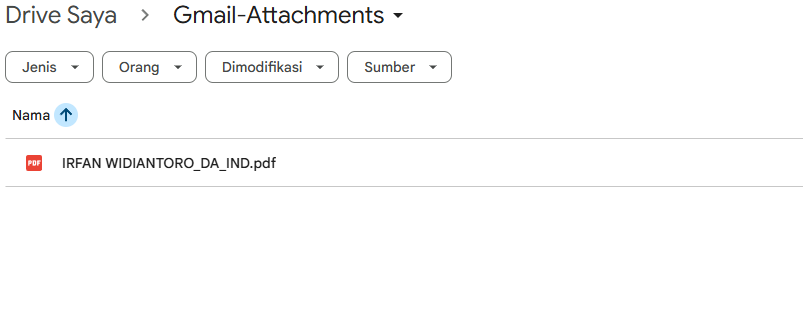

# PA-01 – Menyimpan Lampiran Gmail ke Google Drive

## Deskripsi
Flow Power Automate yang secara otomatis menyimpan lampiran email dari Gmail ke Google Drive setiap kali email baru masuk, tanpa perlu pengunduhan manual.

Project ini dibuat untuk meningkatkan efisiensi kerja dan mengurangi risiko file terlewat atau hilang.

---

## Flow Logic

---

## Trigger
- **Gmail – Saat email baru tiba**
- **Memiliki Lampiran**: Ya
- **Sertakan Lampiran**: Ya

---

## Actions
1. **Terapkan ke setiap (Lampiran)**
   - Melakukan iterasi untuk setiap file lampiran dalam email.
2. **Buat file (Google Drive)**
   - Menyimpan setiap lampiran ke folder tujuan di Google Drive.

---

## Tools & Technologies
- Microsoft Power Automate
- Konektor Gmail
- Konektor Google Drive

---

## Use Case
- Otomatisasi penyimpanan faktur dari email
- Pencadangan lampiran email
- Alur kerja administrasi
- Mengurangi proses manual dan human error

---

## Result

Semua lampiran email berhasil disimpan secara otomatis ke Google Drive dengan nama file asli dan format yang sesuai.

---

## Catatan
- Flow ini dapat dikembangkan lebih lanjut dengan:
  - Penamaan folder berdasarkan tanggal atau pengirim
  - Filtering email berdasarkan subject atau label
  - Notifikasi jika proses penyimpanan gagal
