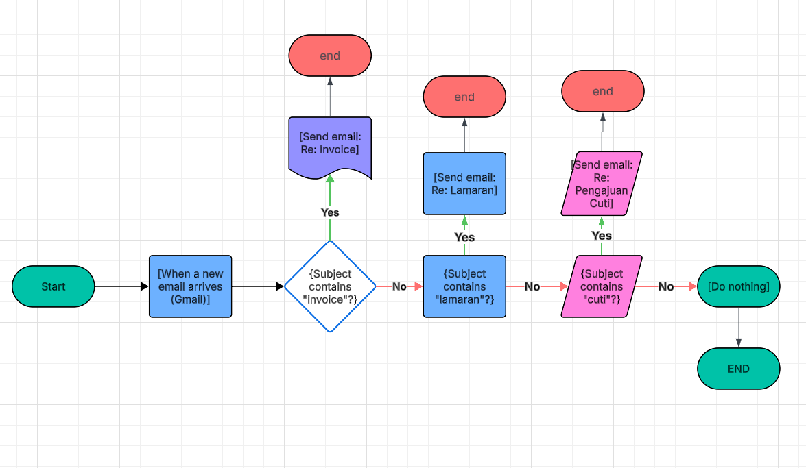
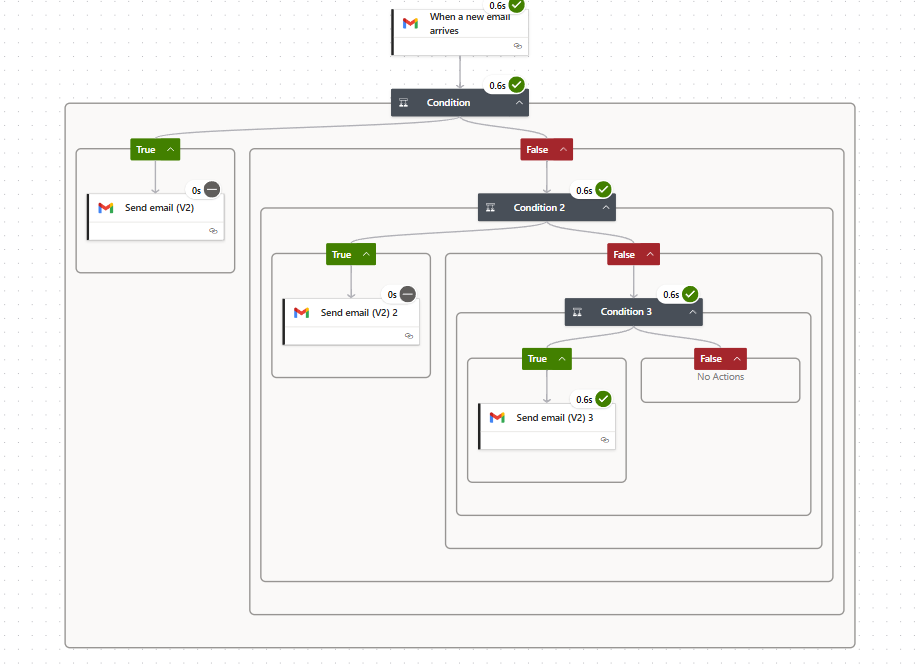
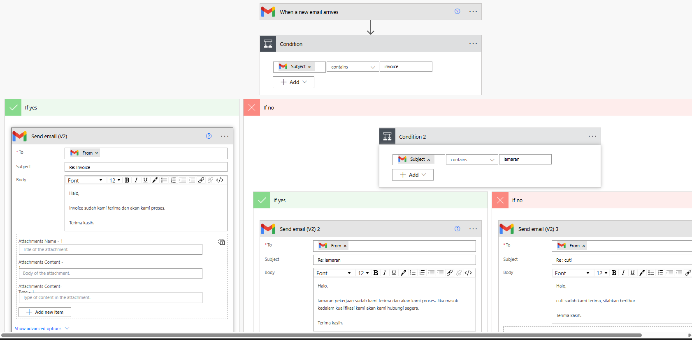
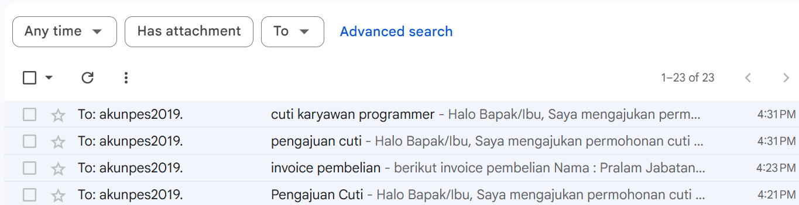
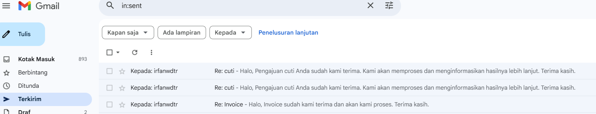
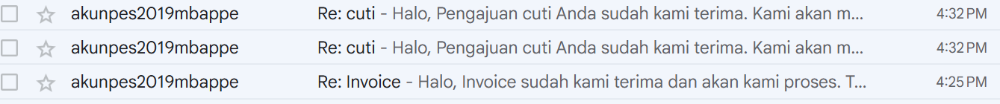

# PA-03 – Auto Reply Email Berdasarkan Keyword (Gmail)

## Deskripsi
Flow Power Automate yang secara otomatis membalas email masuk di Gmail berdasarkan
keyword pada subject email.  
Flow ini dirancang untuk kebutuhan dunia kerja seperti penanganan **invoice,
lamaran kerja, dan pengajuan cuti** tanpa perlu respon manual.

---

## Flow Logic
Diagram alur kerja flow:

---

## Trigger
- **Gmail – When a new email arrives**
- Email diproses berdasarkan **kata kunci pada subject**

---

## Logic & Conditions
Flow menggunakan **condition berantai (contains)** yang umum dipakai di lingkungan kerja:

1. Jika subject **mengandung "invoice"**
   - Sistem mengirim balasan konfirmasi invoice
2. Jika subject **mengandung "lamaran"**
   - Sistem mengirim balasan konfirmasi lamaran kerja
3. Jika subject **mengandung "cuti"**
   - Sistem mengirim balasan konfirmasi pengajuan cuti
4. Jika tidak memenuhi kondisi di atas
   - Tidak ada aksi (do nothing)

---

## Actions
- Gmail – Send email (balasan otomatis ke pengirim)

---

## Tools & Technologies
- Microsoft Power Automate
- Gmail Connector

---

## Screenshot Implementasi

### Bukti Flow di Power Automate
(Bukti alur flow pada Power Automate ditampilkan di bagian bawah)

---

### Uji Coba Manual (Pengiriman Pesan)
Pengujian dilakukan dengan mengirim email secara manual menggunakan subject tertentu.

---

### Pesan Balasan Otomatis
Email balasan dikirim otomatis oleh sistem sesuai dengan keyword pada subject.

---

### Pesan Diterima oleh Pengirim
Hasil akhir berupa email balasan yang diterima oleh pengirim.

---

## Use Case
- Konfirmasi penerimaan invoice
- Auto reply lamaran kerja
- Konfirmasi pengajuan cuti karyawan
- Mengurangi respon manual dan human error

---

## Result
Sistem berhasil:
- Mendeteksi keyword pada subject email
- Mengirim balasan otomatis sesuai konteks
- Menjalankan flow secara konsisten tanpa intervensi manual

