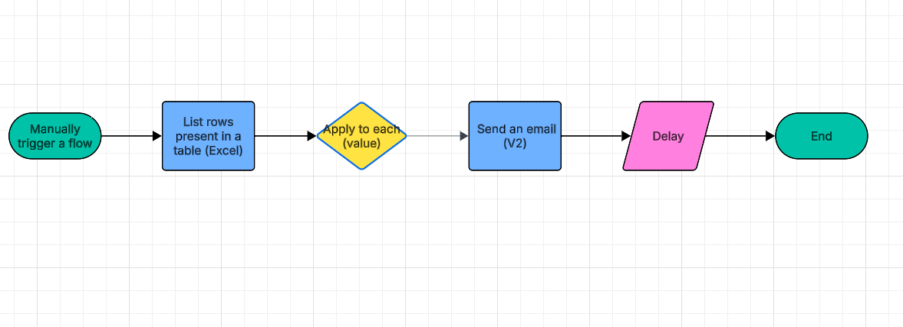

# PA-04 – Kirim Email Otomatis dari Excel (Outlook → Gmail)

## Deskripsi
Flow Power Automate yang digunakan untuk **mengirim email massal secara otomatis**
berdasarkan data yang tersimpan di **Excel Online (OneDrive)**.  
Flow ini cocok untuk kebutuhan kerja seperti **notifikasi massal, reminder,
pengumuman internal, dan testing sistem email** tanpa pengiriman manual satu per satu.

---

## Flow Logic
Diagram alur kerja flow:



---

## Trigger
- **Manually trigger a flow**
- Flow dijalankan secara manual untuk mengontrol waktu dan jumlah email yang dikirim

---

## Data Source
- **Excel Online (Business)**
- Data disimpan dalam bentuk **Table** dengan nama `tblEmail`

### Struktur Dataset Excel
Kolom yang digunakan:
- `Email` → alamat email penerima
- `Subject` → subject email
- `Body` → isi email

Contoh dataset (copy–paste ke Excel):

```txt
Email	Subject	Body
test1@gmail.com	Pemberitahuan Promo	Halo, kami ingin menginformasikan promo terbaru bulan ini. Terima kasih.
test2@gmail.com	Pengingat Pembayaran	Halo, ini adalah pengingat pembayaran invoice Anda. Mohon segera ditindaklanjuti.
test3@gmail.com	Undangan Meeting	Halo, Anda diundang untuk meeting online besok pukul 10.00 WIB.
